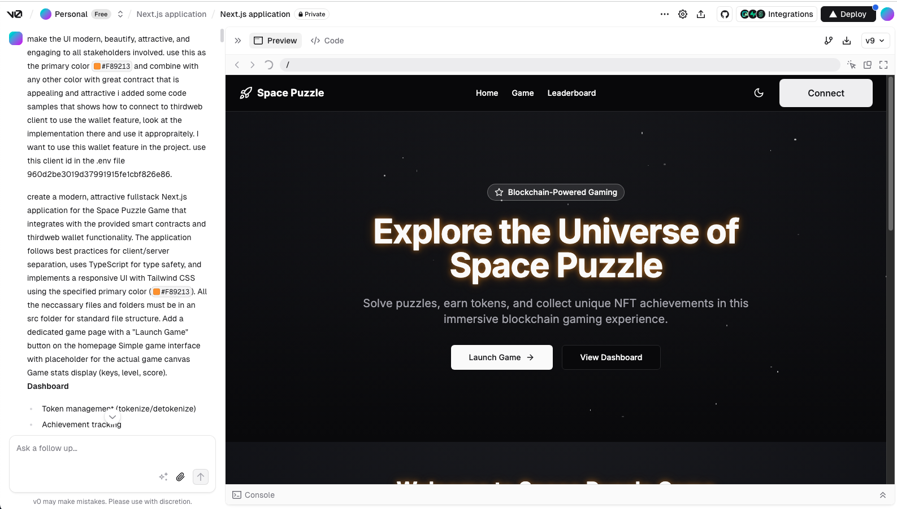
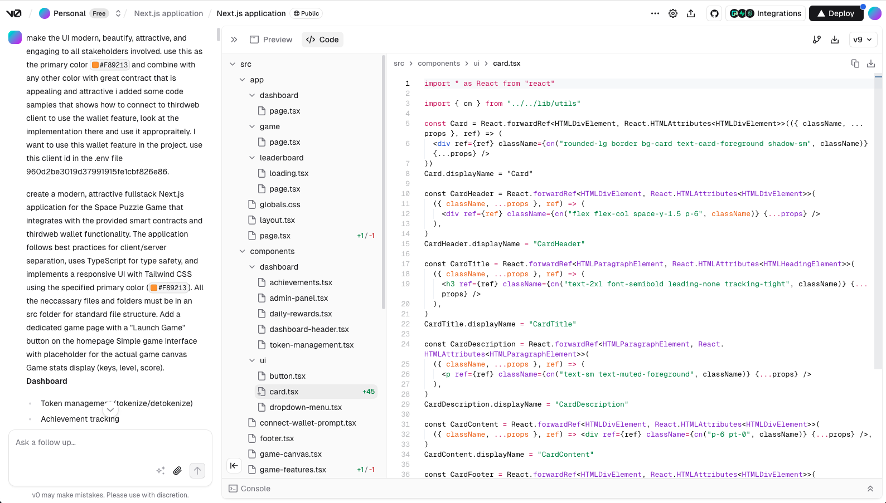

# 🤖 AI Documentation – Space Puzzle

This file documents how AI tools were used during the development of _Space Puzzle_

---

## 🧠 AI Tools Used

- **ChatGPT (GPT-4)** — for smart contract scaffolding and product requirement document
- **V0.dev** — for [link to code](https://v0.dev/chat/next-js-application-l9lkYOqHDfH)
- **Cursor AI** - for troubleshooting errors and code refactoring

---

## 🔍 AI-Enhanced Modules & Prompts

### 1. Product Requirement Document and Smart Contract Generation

**Tool**: ChatGPT
**Prompt**:

```json
[
  {
    "prompt": "Could you generate a well structured Product Requirement Document (PRD) for a gamified on-chain experience called SpacePuzzleGame. The game must: Track player progression including points, keys, levels, scores, allow daily point claiming (with 5 minute cooldown), enable key-to-point conversion (50 keys = 10 points), automatically award NFTs as badges (ERC721) for reaching thresholds (Bronze: 50 points, Silver: 200 points, and Gold: 900 points), Store player data including highest score and level, maintain a top 10 high score leaderboard, restrict certain functions (like resetPlayerData and manual mintBadge) to contract owner, and emit appropriate events and expose view functions for front-end consumption."
  }
]
```

```json
[
  {
    "prompt": "Create a Solidity smart contract named SpacePuzzleGame for a blockchain-based game that incorporates an on-chain badge and point reward system using NFTs. The contract should inherit from OpenZeppelin’s ERC721 and Ownable contracts and utilize OpenZeppelin’s Counters library for auto-incrementing NFT token IDs. Define a Player struct to store player-specific data including total points, game keys collected, timestamp of last daily point claim, highest score achieved, current session score, current level, highest level reached, and a mapping(uint256 => bool) to track badge ownership, where 1 = Bronze, 2 = Silver, and 3 = Gold. Key constants include DAILY_POINTS = 1, CLAIM_COOLDOWN = 5 minutes, KEYS_PER_POINT_CONVERSION = 50, POINTS_PER_CONVERSION = 10, and badge thresholds at 50, 200, and 900 points. Core gameplay functions must include claimDailyPoints() for daily rewards and badge checks, convertKeysToPoints(uint256) to exchange keys for points and trigger badge minting, and methods to manage keys, scores, levels, and badge issuance. Specifically, include internal and owner-only functions for minting badges (_checkAndMintBadges, _mintBadge, mintBadge) and maintaining a top-10 high score leaderboard with _updateTopScores. Emit events such as BadgeMinted, PointsClaimed, KeysConverted, KeysAdded, KeysRemoved, ScoreUpdated, and LevelUpdated to track major gameplay actions. Add view functions to retrieve player statistics and badge status: getPlayerPoints, getPlayerKeys, getPlayerHighScore, getPlayerCurrentScore, getPlayerCurrentLevel, getPlayerHighestLevel, getTopScores, getNextClaimTime, getPlayerBadges (returns bool[3]), and hasBadge. Include an owner-only resetPlayerData(address) function to clear a player’s data for testing. Ensure the contract follows Solidity best practices with modular, gas-efficient design and proper use of access control, structs, mappings, and ERC721 minting mechanisms."
  }
]
```

**Output**:

- [SpacePuzzleGame.sol after some refinement](./contracts/contracts/SpacePuzzleGame.sol)

---

### 2. UI Development

**Tool**: v0.dev  
**Prompt**:
The original prompt is too long so I refined it a bit. [Here](https://v0.dev/chat/next-js-application-l9lkYOqHDfH) is the original code.

```json
[
  {
    "prompt": "Create a modern, fullstack Next.js application for the Space Puzzle Game with a clean, attractive, and responsive UI that appeals to all stakeholders, using Tailwind CSS with `#F89213` as the primary color complemented by a high-contrast, visually appealing secondary color; the app should follow best practices for client/server separation using TypeScript, include a homepage with a 'Launch Game' button leading to a dedicated game page featuring a simple placeholder canvas and game stats (keys, level, score), and provide a robust dashboard with role-based access for token management, achievement tracking, daily rewards, and admin-only functions tied to smart contracts (GameToken, RewardPool, SpacePuzzleNFT), while integrating thirdweb wallet functionality via the provided code samples and `.env` client ID (`960d2be3019d37991915fe1cbf826e86`) and connecting to the Core Blockchain Testnet 2 with proper error handling, loading states, and consistent styling throughout—all source code should reside in an `src/` directory using a modular and maintainable structure."
  }
]
```

**Output**:



---

### 3. Troubleshooting errors

**Tool**: Cursor AI
**Contribution**:

- Code completion
- Refactoring sample code
- Assisted with errors

---

## 💬 Prompt Summary (for JSON Submission)

```json
[
  {
  {
    "tool": "ChatGPT",
    "use_case": "Product Requirement Document",
    "prompt": "Could you generate a well structured Product Requirement Document (PRD) for a gamified on-chain experience called SpacePuzzleGame. The game must: Track player progression including points, keys, levels, scores, allow daily point claiming (with 5 minute cooldown), enable key-to-point conversion (50 keys = 10 points), automatically award NFTs as badges (ERC721) for reaching thresholds (Bronze: 50 points, Silver: 200 points, and Gold: 900 points), Store player data including highest score and level, maintain a top 10 high score leaderboard, restrict certain functions (like resetPlayerData and manual mintBadge) to contract owner, and emit appropriate events and expose view functions for front-end consumption."
  },
    "tool": "ChatGPT",
    "use_case": "Solidity smart contract",
    "prompt": "Create a Solidity smart contract named SpacePuzzleGame for a blockchain-based game that incorporates an on-chain badge and point reward system using NFTs. The contract should inherit from OpenZeppelin’s ERC721 and Ownable contracts and utilize OpenZeppelin’s Counters library for auto-incrementing NFT token IDs. Define a Player struct to store player-specific data including total points, game keys collected, timestamp of last daily point claim, highest score achieved, current session score, current level, highest level reached, and a mapping(uint256 => bool) to track badge ownership, where 1 = Bronze, 2 = Silver, and 3 = Gold. Key constants include DAILY_POINTS = 1, CLAIM_COOLDOWN = 5 minutes, KEYS_PER_POINT_CONVERSION = 50, POINTS_PER_CONVERSION = 10, and badge thresholds at 50, 200, and 900 points. Core gameplay functions must include claimDailyPoints() for daily rewards and badge checks, convertKeysToPoints(uint256) to exchange keys for points and trigger badge minting, and methods to manage keys, scores, levels, and badge issuance. Specifically, include internal and owner-only functions for minting badges (_checkAndMintBadges, _mintBadge, mintBadge) and maintaining a top-10 high score leaderboard with _updateTopScores. Emit events such as BadgeMinted, PointsClaimed, KeysConverted, KeysAdded, KeysRemoved, ScoreUpdated, and LevelUpdated to track major gameplay actions. Add view functions to retrieve player statistics and badge status: getPlayerPoints, getPlayerKeys, getPlayerHighScore, getPlayerCurrentScore, getPlayerCurrentLevel, getPlayerHighestLevel, getTopScores, getNextClaimTime, getPlayerBadges (returns bool[3]), and hasBadge. Include an owner-only resetPlayerData(address) function to clear a player’s data for testing. Ensure the contract follows Solidity best practices with modular, gas-efficient design and proper use of access control, structs, mappings, and ERC721 minting mechanisms."
  },
  {
    "tool": "v0.dev",
    "use_case": "Frontend UI",
    "prompt": "Create a modern, fullstack Next.js application for the Space Puzzle Game with a clean, attractive, and responsive UI that appeals to all stakeholders, using Tailwind CSS with `#F89213` as the primary color complemented by a high-contrast, visually appealing secondary color; the app should follow best practices for client/server separation using TypeScript, include a homepage with a 'Launch Game' button leading to a dedicated game page featuring a simple placeholder canvas and game stats (keys, level, score), and provide a robust dashboard with role-based access for token management, achievement tracking, daily rewards, and admin-only functions tied to smart contracts (GameToken, RewardPool, SpacePuzzleNFT), while integrating thirdweb wallet functionality via the provided code samples and `.env` client ID (`960d2be3019d37991915fe1cbf826e86`), supporting multiple authentication methods (Google, email, phone), and connecting to the Core Blockchain Testnet 2 with proper error handling, loading states, and consistent styling throughout—all source code should reside in an `src/` directory using a modular and maintainable structure."
  },
  {
    "tool": "Cursor AI",
    "use_case": "Troubleshooting",
    "prompt": "I'm getting this error 'Console ErrorAn empty string ("") was passed to the src attribute. This may cause the browser to download the whole page again over the network. To fix this, either do not render the element at all or pass null to src instead of an empty string"
  }
]
```

---

## 🧠 Prompt Engineering Best Practices & Insights Used

### 1. **Clear Objective Definition**

> _"Create a modern, attractive fullstack Next.js application for the Space Puzzle Game..."_

- **Insight**: Stating a precise, outcome-focused goal early in the prompt helps the model anchor its response.
- **Best Practice**: Always lead with what you want — the _what_ and _why_ set context for everything else.

### 2. **Layered Detail & Contextual Framing**

- **Insight**: Details such as smart contract names, color codes, authentication methods, and UI components were layered into the prompt.
- **Best Practice**: Provide layered, structured context to guide the model’s response; don’t front-load everything in a block — pace it for clarity.

### 3. **Explicit Technical Constraints**

> _"Use Tailwind CSS," "place all files in `src/` folder," "TypeScript for type safety"_

- **Insight**: Constraints guide the model toward feasible implementation paths.
- **Best Practice**: The more concrete the constraints (tools, structure, formats), the more relevant and implementable the output.

### 4. **Separation of Concerns via Thematic Grouping**

- **Insight**: Grouping by features like Wallet Integration, Dashboard, Smart Contract, UI, and Technical Implementation helps the model maintain organized output.
- **Best Practice**: Use **semantic structuring** — organize prompts in themes/sections to mirror desired output structure.

### 5. **Human-Centered Framing**

> _"Modern, beautify, attractive, and engaging to all stakeholders..."_

- **Insight**: This encourages the model to consider UX/UI design beyond pure function — helpful for front-end and product-focused tasks.
- **Best Practice**: Prompt the model to think in terms of user value and stakeholder appeal to get more holistic responses.

---

## 📈 AI Impact

AI contributed to:

- ~50% of smart contract logic, Product Requirement Document
- All prompt-based writing
- Reducing development time by ~50%
- Troubleshooting dependency issues
