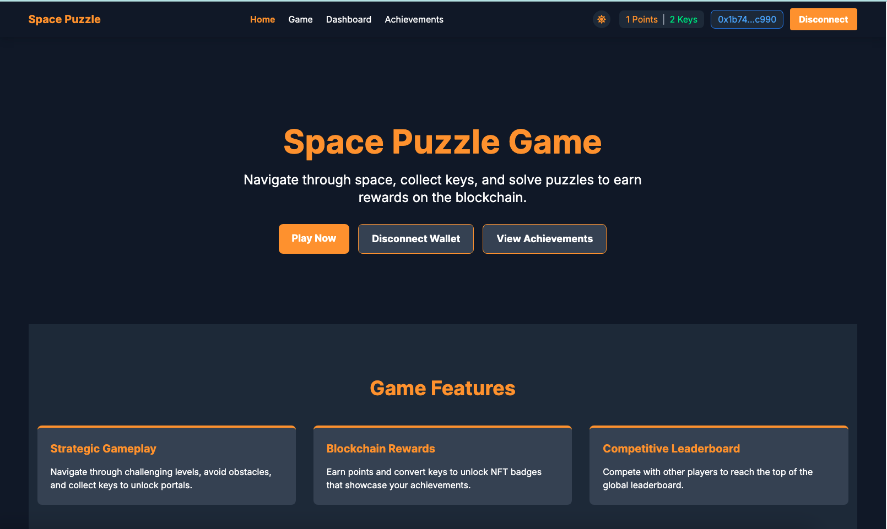
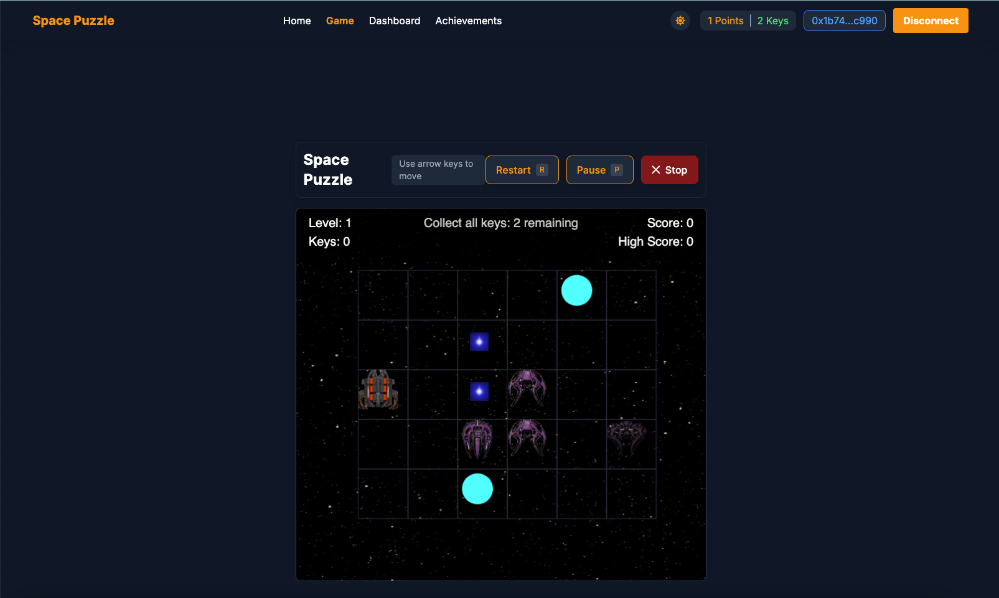
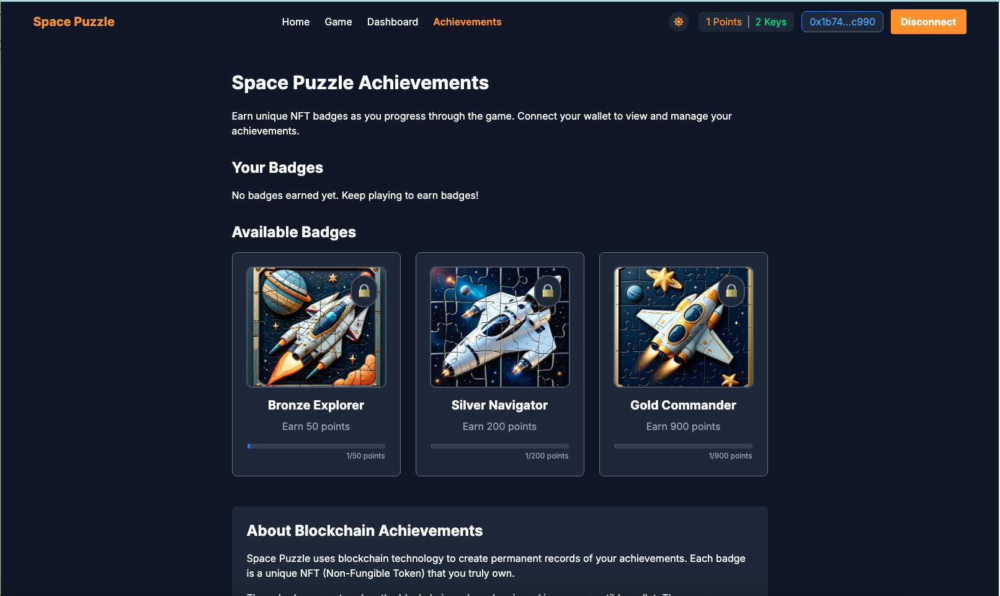
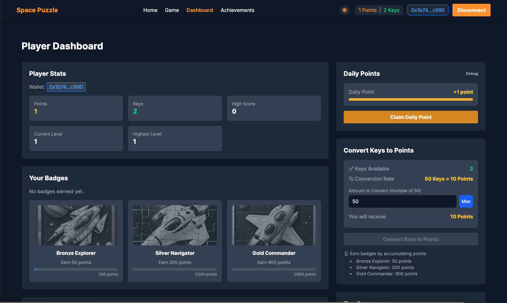

# 🪐 Space Puzzle



**Track:** Identity & Reputation in Web3  
**Chain:** Rootstock Testnet (Chain ID 31)  
**Built For:** (A)I BUIDL Lab on Rootstock  
**SpacePuzzleGame deployed to:** 0x61C34f6C430DFD6Bcc14D5efCc18C7D799BEA5c6

**Live Demo**: [https://space-puzzle-game-on-rootstock.vercel.app/](https://space-puzzle-game-on-rootstock.vercel.app/)

---

## 🎯 Overview

Space Puzzle is a decentralized, blockchain-based puzzle game that transforms your gameplay into a permanent, on-chain reputation system. Players earn NFT badges as proof of their achievements, build a transparent skill profile on-chain, and compete on a global leaderboard that reflects their logic, decision-making, and persistence.

Built on the Rootstock blockchain and developed using AI tools like ChatGPT and v0, Space Puzzle showcases a real-life use case for Web3-based identity and reputation tracking via verifiable game accomplishments.

---

## 🧾 Key Features

- **On-Chain Identity**: Each player has a persistent, blockchain-based profile linked to achievements, performance, and level completion.
- **Reputation System**:
  - Earn NFT badges: `Bronze Explorer`, `Silver Navigator`, `Gold Commander`
  - Top 10 Leaderboard: Smart contract tracks global rankings
  - Daily activity boosts: Rewards claimed via cooldown-enforced functions
- **AI-Enhanced Development**:
  - Product Requirement Document
  - Smart contract generation
  - UI components

---

## 🖼️ Screenshots

  
  


---

## 🔗 Tech Stack

- **Frontend**: Next.js, Ethers.js, Web3Modal
- **Smart Contracts**: Solidity, Hardhat, Rootstock Testnet
- **NFTs**: ERC721 for achievement badges
- **Wallet**: MetaMask (Rootstock Testnet Configured)
- **AI Tools**: ChatGPT (GPT-4), v0.dev, cursor ai

---

## 🎥 Demo Video

[Watch Demo Video](https://drive.google.com/drive/folders/1Rob4alWlDZGrAHyYckPCxK55bdr4_dpI?usp=sharing)

---

## 🧠 AI Prompt/Assistance

This project used ChatGPT, cursor ai, and v0 to assist with:

- Product Requirement Document generation
- Smart contract code for NFT minting and leaderboard scoring
- Debugging and troubleshooting issues

See full [AI Prompt Documentation/Submission](./AI_DOCS.md)

---

## 🛠️ Getting Started

### Prerequisites

- Node.js v16+
- MetaMask (configured for Rootstock Testnet)

### Setup

```bash
git clone https://github.com/harystyleseze/space-puzzle-game-on-rootstock
cd space-puzzle-game-on-rootstock
npm install
```

### Environment

Create `.env.local`:

```env
NEXT_PUBLIC_SPACE_PUZZLE_GAME_ADDRESS=0xYourContractAddress
```

### Start the App

```bash
npm run dev
```

Open [http://localhost:3000](http://localhost:3000) in your browser.

### Smart Contract Deployment (Optional)

If you want to deploy your own instance of the game's smart contract:

1. Navigate to the contracts directory:

   ```bash
   cd contracts
   ```

2. Install dependencies:

   ```bash
   npm install
   # or
   yarn install
   ```

3. Create a `.env` file with your private key:

   ```
   ROOTSTOCK_TESTNET_PRIVATE_KEY="YOUR-PRIVATE-KEY"
   ```

4. Compile the contract:

   ```bash
   npx hardhat compile
   ```

5. Deploy to Rootstock Testnet:

   ```bash
   npx hardhat run scripts/deploy.js --network rskTestnet
   ```

6. Update the `.env.local` file in the project root with your new contract address.

---

## 🎮 How to Play

1. **Connect your wallet** using the "Connect Wallet" button.
2. Navigate to the **Play** section to start a new game.
3. **Move your spaceship** using arrow keys (desktop) or swipe/buttons (mobile).
4. **Collect all keys** in the level to activate the portal.
5. **Reach the activated portal** to advance to the next level.
6. **Save your progress** by quitting the game and confirming the save.
7. Visit the **Dashboard** to view your stats, badges, and claim daily rewards.
8. Check the **Achievements** page to see your earned and unearned badges.

---

## 📚 Game Controls

### Desktop

- **Arrow Keys**: Move the spaceship
- **P**: Pause/Resume game
- **R**: Restart level
- **ESC**: Quit game

### Mobile

- **Swipe**: Move in the direction of the swipe
- **On-screen arrows**: Move in the corresponding direction
- **P button**: Pause/Resume game
- **R button**: Restart level
- **X button**: Quit game

---

## 📊 Scoring System

- Completing a level: Points based on level number and difficulty multiplier
- Higher levels award more points
- Your high score is stored on the blockchain
- Top 10 global scores appear on the leaderboard

---

## 📱 Mobile Compatibility

Space Puzzle is fully responsive and playable on mobile devices with:

- Touch controls
- Swipe navigation
- On-screen buttons
- Responsive UI that adapts to screen size

---

## 🏆 Reputation System Logic

| Achievement      | NFT Badge      | Conditions                           |
| ---------------- | -------------- | ------------------------------------ |
| Bronze Explorer  | ERC721         | Complete 5 levels or reach 50 points |
| Silver Navigator | ERC721         | Complete 10 levels or 200 points     |
| Gold Commander   | ERC721         | Complete 20 levels or 900 points     |
| Top Player       | Smart Contract | Appear in top 10 leaderboard         |

---

## 📝 License

MIT License
